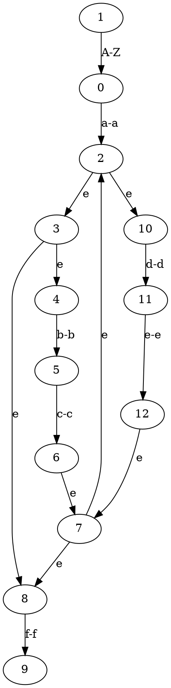

## TOC

* [Overview](#overview)
* [Build](#build)
* [Example](#example)
* [Automata](#automata)

## Overview

clex is a simple lexer generator for C.

With clex you can initialize a lexer with `clexInit()` call, then register a regex pattern to each token type with `clexRegisterKind(lexer, regex, type)` call, pass the source using `clexReset(source)` call, and then lex the next token with `clex(lexer)` call.

At the end of the input string `clex(lexer)` returns `(Token){.lexeme = NULL, .kind = -1}`.

The maximum number of rules is 1024, but you can change that number in `clex.h`: `#define CLEX_MAX_RULES 1024`

## Build

Simply pass `fa.c`, `fa.h`, `clex.c`, and `clex.h` to your compiler along with your own application that has a `main` function.

Here's how to build & run the tests:

`gcc tests.c fa.c fa.h clex.c clex.h -D TEST_CLEX` (there's also `TEST_REGEX` and `TEST_NFA_DRAW`)

No output means all tests passed!

## Example

```c
#include "clex.h"
#include <assert.h>
#include <string.h>

typedef enum TokenKind {
  INT,
  OPARAN,
  CPARAN,
  OSQUAREBRACE,
  CSQUAREBRACE,
  OCURLYBRACE,
  CCURLYBRACE,
  COMMA,
  CHAR,
  STAR,
  RETURN,
  SEMICOL,
  CONSTANT,
  IDENTIFIER,
} TokenKind;

int main(int argc, char *argv[]) {
  clexLexer *lexer = clexInit();

  clexRegisterKind(lexer, "int", INT);
  clexRegisterKind(lexer, "\\(", OPARAN);
  clexRegisterKind(lexer, "\\)", CPARAN);
  clexRegisterKind(lexer, "\\[|<:", OSQUAREBRACE);
  clexRegisterKind(lexer, "\\]|:>", CSQUAREBRACE);
  clexRegisterKind(lexer, "{|<%", OCURLYBRACE);
  clexRegisterKind(lexer, "}|%>", CCURLYBRACE);
  clexRegisterKind(lexer, ",", COMMA);
  clexRegisterKind(lexer, "char", CHAR);
  clexRegisterKind(lexer, "\\*", STAR);
  clexRegisterKind(lexer, "return", RETURN);
  clexRegisterKind(lexer, "[1-9][0-9]*([uU])?([lL])?([lL])?", CONSTANT);
  clexRegisterKind(lexer, ";", SEMICOL);
  clexRegisterKind(lexer, "[a-zA-Z_]([a-zA-Z_]|[0-9])*", IDENTIFIER);

  clexReset(lexer, "int main(int argc, char *argv[]) {\nreturn 23;\n}");

  Token token = clex(lexer);
  assert(token.kind == INT);
  assert(strcmp(token.lexeme, "int") == 0);

  token = clex(lexer);
  assert(token.kind == IDENTIFIER);
  assert(strcmp(token.lexeme, "main") == 0);

  token = clex(lexer);
  assert(token.kind == OPARAN);
  assert(strcmp(token.lexeme, "(") == 0);

  token = clex(lexer);
  assert(token.kind == INT);
  assert(strcmp(token.lexeme, "int") == 0);

  token = clex(lexer);
  assert(token.kind == IDENTIFIER);
  assert(strcmp(token.lexeme, "argc") == 0);

  token = clex(lexer);
  assert(token.kind == COMMA);
  assert(strcmp(token.lexeme, ",") == 0);

  token = clex(lexer);
  assert(token.kind == CHAR);
  assert(strcmp(token.lexeme, "char") == 0);

  token = clex(lexer);
  assert(token.kind == STAR);
  assert(strcmp(token.lexeme, "*") == 0);

  token = clex(lexer);
  assert(token.kind == IDENTIFIER);
  assert(strcmp(token.lexeme, "argv") == 0);

  token = clex(lexer);
  assert(token.kind == OSQUAREBRACE);
  assert(strcmp(token.lexeme, "[") == 0);

  token = clex(lexer);
  assert(token.kind == CSQUAREBRACE);
  assert(strcmp(token.lexeme, "]") == 0);

  token = clex(lexer);
  assert(token.kind == CPARAN);
  assert(strcmp(token.lexeme, ")") == 0);

  token = clex(lexer);
  assert(token.kind == OCURLYBRACE);
  assert(strcmp(token.lexeme, "{") == 0);

  token = clex(lexer);
  assert(token.kind == RETURN);
  assert(strcmp(token.lexeme, "return") == 0);

  token = clex(lexer);
  assert(token.kind == CONSTANT);
  assert(strcmp(token.lexeme, "23") == 0);

  token = clex(lexer);
  assert(token.kind == SEMICOL);
  assert(strcmp(token.lexeme, ";") == 0);

  token = clex(lexer);
  assert(token.kind == CCURLYBRACE);
  assert(strcmp(token.lexeme, "}") == 0);

  token = clex(lexer);
  assert(token.kind == -1);
  assert(token.lexeme == NULL);
}
```

# Automata

NFA can be drawn with Graphviz.

```c
#include "fa.h"

int main(int argc, char *argv) {
  Node *nfa = clexNfaFromRe("[A-Z]a(bc|de)*f");
  clexNfaDraw(nfa);
}
```

Above code will output this to stdout:



The output can be processed with Graphviz to get the graph image: `dot -Tpng output.dot > output.png`.

Here's what it produces:


